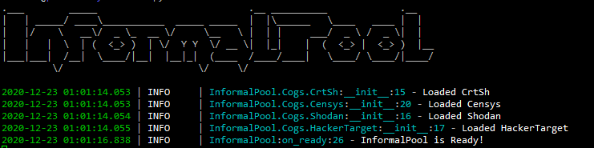

# InformalPool


# Usage
```bash
pip install -r requirements.txt
mv example.env .env

./bot.py
```

# What
InformalPool is supposed to be a tool that is a direct interface to multiple "free" API that can be used as recon toward sites.
